<!-- ═══════════════════════════════════════════════════════════════ -->
<!--                    MRINAL PRAKASH — README                     -->
<!-- ═══════════════════════════════════════════════════════════════ -->

<div align="center">

<!-- ── ANIMATED HEADER ── -->


<br/>

<!-- ── TYPING ANIMATION ── -->
[](https://git.io/typing-svg)

<br/>

<!-- ── SOCIAL BADGES ── -->
[](https://linkedin.com/in/mrinal-prakash)
[](https://github.com/MRINALPRAKASHFSD)
[](https://mrinalprakash.com)
[](https://instagram.com/mrinal.prakash)
[](mailto:prakashmrinal9@gmail.com)

<br/>

<!-- ── COUNTERS ── -->
&nbsp;
&nbsp;


</div>

<br/>

---

<!-- ══════════════════════════════════════════════ -->
<!--                  ABOUT ME                      -->
<!-- ══════════════════════════════════════════════ -->

## 🧠 About Me

<div align="center">

</div>

<br/>

```yaml
# ── mrinal.config.yaml ──────────────────────────

name      : "Mrinal Prakash"
alias     : "Late-Night Builder"
pronouns  : "He / Him"
location  : "Delhi / Gurugram, India 🇮🇳"

motto: >
  "I don't just code.
   I build scalable solutions
   that founders trust."

currently:
  - role  : "Chapter President"
    org   : "GeekRoom KRMU"
    since : "Jun 2026"

  - role  : "Managing Director"
    org   : "eOzka"
    since : "Apr 2026"

  - role  : "Student Ambassador"
    org   : "CoE Cloud Computing, KRMU"
    since : "Jan 2026"

open_to:
  ✅ Freelance Projects & Startup Collabs
  ✅ High-Impact Internships
  ✅ Technical Leadership Roles
  ✅ Open-Source Contributions

fun_facts:
  🏆 Mentored 50+ junior developers
  📊 6,949+ LinkedIn followers
  🌍 Active open-source contributor
  ☕ Powered by chai & late-night commits
```

<br/>

---

<!-- ══════════════════════════════════════════════ -->
<!--                CURRENT ROLES                   -->
<!-- ══════════════════════════════════════════════ -->

## 🚀 Current Roles

<div align="center">

| 🎯 Role | 🏢 Organization | 📅 Since | 📍 Mode |
|--------|----------------|---------|---------|
| 👑 **Chapter President** | GeekRoom KRMU | Jun 2026 | On-site |
| 🏢 **Managing Director** | eOzka | Apr 2026 | Hybrid |
| 🌩️ **Student Ambassador** | CoE Cloud Computing, KRMU | Jan 2026 | On-site |

</div>

<br/>

---

<!-- ══════════════════════════════════════════════ -->
<!--                 TECH STACK                     -->
<!-- ══════════════════════════════════════════════ -->

## 🛠️ Tech Arsenal

<div align="center">

### 💬 Languages
[](https://skillicons.dev)

### 🎨 Frontend
[](https://skillicons.dev)


### ⚙️ Backend
[](https://skillicons.dev)


### 🗄️ Databases
[](https://skillicons.dev)

### 🤖 AI / ML
[](https://skillicons.dev)


### 🚀 DevOps & Tools
[](https://skillicons.dev)


</div>

<br/>

---

<!-- ══════════════════════════════════════════════ -->
<!--              FEATURED PROJECTS                 -->
<!-- ══════════════════════════════════════════════ -->

## 🏆 Featured Projects

<div align="center">

<a href="https://mini-project-paradigm-shift-5y6i.vercel.app/">
  
</a>&nbsp;
<a href="https://aetherflowintelligence.vercel.app/">
  
</a>
<a href="https://pollu-track-topaz.vercel.app/">
  
</a>

</div>

<br/>

<div align="center">

| 🔥 Project | ⚡ Stack | 🌐 | 📊 Impact |
|-----------|---------|---|----------|
| **ParadigmShift HRMS** | React 18 · Node · MongoDB · Socket.io · JWT · RBAC | [Live →](https://mini-project-paradigm-shift-5y6i.vercel.app/) | 6-member Agile team · 20+ API routes · 11 real-time events |
| **AetherFlow Supply Intelligence** | Next.js 16 · SQLite · Neural Sim Engine · RBAC | [Live →](https://aetherflowintelligence.vercel.app/) | 17-table schema · 3,200+ records · 300%+ shock tests |
| **PolluTrack** | Leaflet.js · Chart.js · WAQI API · AI Advisor | [Live →](https://pollu-track-topaz.vercel.app/) | 6,000+ stations · forecasting · PDF reports |
| **SustainFlow Predictor** | Python · scikit-learn · Pandas | Private | **1,000+ daily ML requests** |
| **EmpowerHer** | Full-Stack Web App | Private | **500+ active users** |
| **ShiftKey** | eOzka · On-Demand Driver-as-a-Service | Active | Live under eOzka |

</div>

<br/>

---

<!-- ══════════════════════════════════════════════ -->
<!--               GITHUB TROPHIES                  -->
<!-- ══════════════════════════════════════════════ -->

## 📊 GitHub Stats

<div align="center">


&nbsp;


</div>

<div align="center">

[](https://streak-stats.demolab.com)

</div>

<br/>
---

## 📊 GitHub Dashboard

<p align="center">
  
</p>

---

<!-- ══════════════════════════════════════════════ -->
<!--             CONTRIBUTION GRAPH                 -->
<!-- ══════════════════════════════════════════════ -->

## 📈 Contribution Activity

<div align="center">

[](https://github.com/ashutosh00710/github-readme-activity-graph)

</div>

<br/>

---

<!-- ══════════════════════════════════════════════ -->
<!--            EXPERIENCE TIMELINE                 -->
<!-- ══════════════════════════════════════════════ -->

## 💼 Experience Timeline

```
╔══════════════╦══════════════════════════════════════╦═══════════════════════╗
║   DATE       ║  ROLE                                ║  ORGANIZATION         ║
╠══════════════╬══════════════════════════════════════╬═══════════════════════╣
║  Jun 2026 ▶  ║  👑 Chapter President                ║  GeekRoom KRMU        ║
║  Apr 2026 ▶  ║  🏢 Managing Director                ║  eOzka                ║
║  Jan 2026 ▶  ║  🌩️  Student Ambassador              ║  CoE Cloud · KRMU     ║
║  Jul–Dec 25  ║  🔓 Tech Contributor                 ║  GirlScript GSSOC '25 ║
║  Jun–Aug 25  ║  💻 Full-Stack Dev & Campus Amb.     ║  Musports India       ║
║  Jun–Jul 25  ║  📱 App Developer Intern             ║  CodeAlpha            ║
║  Jun–Jul 25  ║  🌐 Full Stack Developer Intern      ║  CodeAlpha            ║
║  Apr–May 25  ║  🤖 Machine Learning Intern          ║  Future Interns       ║
║  Sep 24–Apr 26  ║  ⚡ Tech Team Lead               ║  TechTribeX           ║
╚══════════════╩══════════════════════════════════════╩═══════════════════════╝
```

<br/>

---

<!-- ══════════════════════════════════════════════ -->
<!--          EDUCATION & CERTIFICATIONS            -->
<!-- ══════════════════════════════════════════════ -->

## 🎓 Education & Certifications

<div align="center">

🎓 &nbsp;**B.Tech Computer Science** &nbsp;|&nbsp; K.R. Mangalam University, Gurugram &nbsp;|&nbsp; **2024 – 2028**

</div>

<details>
<summary><b>📜 &nbsp; View All Certifications &nbsp; (click to expand)</b></summary>

<br/>

<div align="center">

| 🏆 Certification | 🏛️ Issuer | 📅 Issued | 🔖 Key Skills |
|----------------|----------|----------|--------------|
| Google Analytics Certification (2026) | Google Skillshop | Jun 2026 | Web Analytics · Data Analytics |
| Projexa Certificate of Appreciation | KR Mangalam University | May 2026 | React · JWT · Node.js · MongoDB · Next.js |
| Full Stack Dev Internship Completion | CodeAlpha | Aug 2025 | HTML5 · CSS · JS · Bootstrap |
| Intro to Cybersecurity | Cisco Networking Academy | Jul 2025 | Network Security · Cybersecurity |
| App Developer Internship Completion | CodeAlpha | Jul 2025 | HTML · CSS · React |
| AI for Beginners | HP | Jun 2025 | Artificial Intelligence |
| Data Science & Analytics | HP | Jun 2025 | Data Analysis · Statistical Analysis |
| ML Internship Completion | Future Interns | May 2025 | Matplotlib · NLP · Regression Analysis |
| Google Analytics Certification | Google Skillshop | May 2025 | Google Analytics |
| IT Fundamentals | Udemy | Nov 2024 | IT Fundamentals |

</div>
</details>

<br/>

---

<!-- ══════════════════════════════════════════════ -->
<!--               CONNECT SECTION                  -->
<!-- ══════════════════════════════════════════════ -->

## 🌐 Let's Connect & Build Together

<div align="center">

[](https://linkedin.com/in/mrinal-prakash)
[](https://mrinalprakash.com)
[](mailto:prakashmrinal9@gmail.com)
[](https://github.com/MRINALPRAKASHFSD)
[](https://instagram.com/mrinal.prakash)

<br/>

[](https://git.io/typing-svg)

</div>

<br/>

---

<!-- ══════════════════════════════════════════════ -->
<!--           SNAKE CONTRIBUTION ANIMATION         -->
<!-- ══════════════════════════════════════════════ -->

<div align="center">

<picture>
  <source media="(prefers-color-scheme: dark)"
    srcset="https://raw.githubusercontent.com/MRINALPRAKASHFSD/MRINALPRAKASHFSD/output/github-snake-dark.svg" />
  <source media="(prefers-color-scheme: light)"
    srcset="https://raw.githubusercontent.com/MRINALPRAKASHFSD/MRINALPRAKASHFSD/output/github-snake.svg" />
  
</picture>

</div>

<!-- ── ANIMATED FOOTER ── -->

