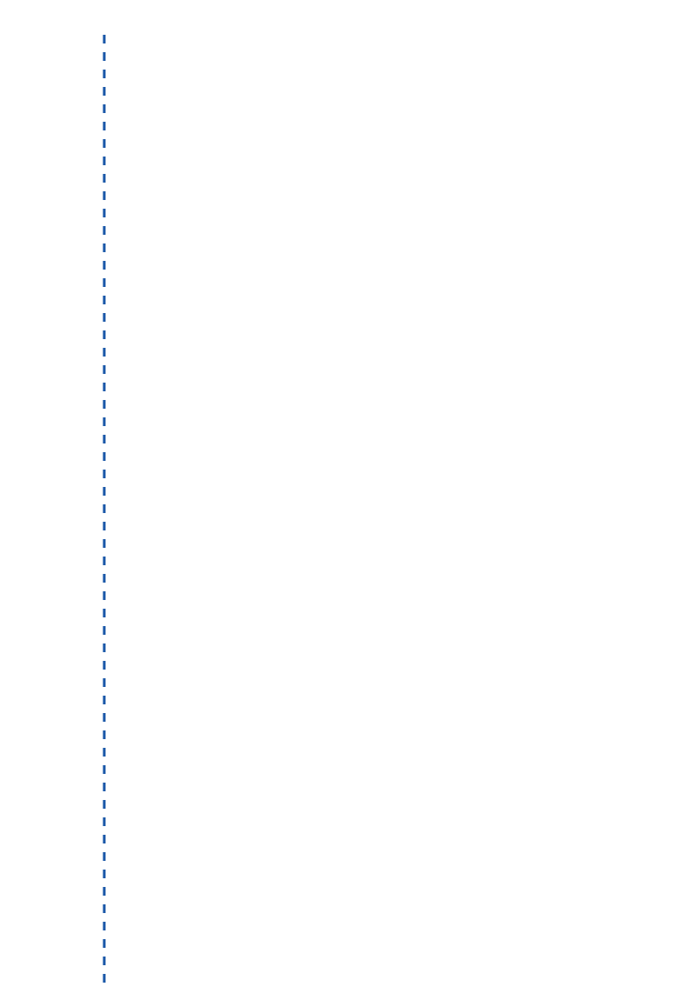

<!-- HEADER BANNER -->
<div align="center">

[](https://github.com/MRINALPRAKASHFSD)

</div>

<!-- TYPING ANIMATION -->
<div align="center">

[](https://github.com/MRINALPRAKASHFSD)

</div>

<br/>

<!-- SOCIAL BUTTONS -->
<div align="center">

[](https://linkedin.com/in/mrinalprakash-fullstackdeveloper)
[](https://github.com/MRINALPRAKASHFSD)
[](https://github.com/MRINALPRAKASHFSD)
[](https://instagram.com/mrinal.prakash)
[](mailto:prakashmrinal9@gmail.com)

</div>

<br/>

<!-- PROFILE COUNTERS -->
<div align="center">


&nbsp;

&nbsp;


</div>

---

## 🧠 About Me

```yaml
# ── mrinal.config.yaml ─────────────────────────────────────

name        : "Mrinal Prakash"
alias       : "Late-Night Builder"
pronouns    : "He / Him"
location    : "Delhi / Gurugram, India 🇮🇳"

motto: >
  "I don't just code.
   I build scalable solutions
   that founders trust."

currently:
  - role  : "Chapter President"
    org   : "GeekRoom KRMU"
    since : "Jun 2026"

  - role  : "Managing Director & Vice Chairperson"
    org   : "eOzka"
    since : "Apr 2026"

  - role  : "Student Ambassador"
    org   : "CoE Cloud Computing, KRMU"
    since : "Jan 2026"

open_to:
  ✅ Freelance Projects & Startup Collabs
  ✅ High-Impact Internships
  ✅ Technical Leadership Roles
  ✅ Open-Source Contributions

fun_facts:
  🏆 Mentored 50+ junior developers
  📊 6,949+ LinkedIn followers
  💻 799 commits · 55-day streak
  ☕ Powered by chai & late-night commits
```

---

## 🛠️ Tech Arsenal

<div align="center">

### 🎨 Frontend & UI


### ⚙️ Backend & API


### 🗄️ Data & AI


### 🚀 DevOps & Tools


</div>

---

## 📊 GitHub Analytics

<div align="center">
  
  
</div>

---

## 📊 Deep Metrics & Habits

<div align="center">
  
</div>

---

## 🏆 GitHub Trophies

<div align="center">

[](https://github.com/MRINALPRAKASHFSD)

</div>

---

## 🔥 Streak Stats

<div align="center">

[](https://github.com/MRINALPRAKASHFSD)

</div>

---

## 📈 Contribution Activity

<div align="center">

[](https://github.com/MRINALPRAKASHFSD)

</div>

---


## 🏗️ Featured Projects

| 🔥 Project | ⚡ Stack | 🌐 Live | 📊 Impact |
|---|---|---|---|
| **ParadigmShift HRMS** | React 18 · Node · MongoDB · Socket.io · JWT · RBAC | [Live →](https://mini-project-paradigm-shift-5y6i.vercel.app) | 6-member Agile team · 20+ API routes · 11 real-time events |
| **AetherFlow Supply Intelligence** | Next.js 16 · SQLite3 · Neural Sim Engine · RBAC | [Live →](https://aetherflowintelligence.vercel.app) | 17-table schema · 3,200+ records · 300%+ shock tests |
| **PolluTrack** | Leaflet.js · Chart.js · WAQI API · AI Advisor | [Live →](https://pollu-track-topaz.vercel.app) | 6,000+ stations · forecasting · PDF reports |
| **SustainFlow Predictor** | Python · scikit-learn · Pandas | Private | **1,000+ daily ML requests** |
| **EmpowerHer** | MERN · Full-Stack Web App | Private | **500+ active users** |
| **ShiftKey** | eOzka · On-Demand Driver-as-a-Service | Active | Live under eOzka |
| **Sentinel Health Watch** | MERN · LSTM · MapboxGL | Built 54hr | HACK KRMU 5.0 · Delhi health dashboard |

*"Building the Inevitable."*

---

## 🧩 LeetCode

<div align="center">

[](https://leetcode.com/u/Mrinalprakash9/)

</div>

> **583 problems solved** &nbsp;·&nbsp; Easy: **168** &nbsp;·&nbsp; Medium: **316** &nbsp;·&nbsp; Hard: **99** &nbsp;·&nbsp; Rank: **#143,107**

---

## 💼 Experience Timeline

<div align="center">
  
</div>

---

## 🐍 Contribution Snake

<div align="center">

<picture>
  <source media="(prefers-color-scheme: dark)" srcset="https://raw.githubusercontent.com/MRINALPRAKASHFSD/MRINALPRAKASHFSD/output/github-snake-dark.svg">
  <source media="(prefers-color-scheme: light)" srcset="https://raw.githubusercontent.com/MRINALPRAKASHFSD/MRINALPRAKASHFSD/output/github-snake.svg">
  
</picture>

</div>

---

## 🏓 ping community

| 🏗️ What I Build | 🤝 How I Connect | 📚 What I'm Exploring |
|---|---|---|
| Full-Stack Web Apps | WhatsApp Tech Networks | Machine Learning & AI/ML |
| Enterprise SaaS Platforms | Hackathon Coordination | Graph Algorithms & DSA |
| Supply Chain Intelligence | Open Source Contributions | AWS Cloud Architecture |
| AI-Powered Dashboards | Technical Mentorship | Geospatial Data Systems |

---

<!-- FOOTER -->
<div align="center">

[](https://github.com/MRINALPRAKASHFSD)

**prakashmrinal9@gmail.com** &nbsp;·&nbsp; [github.com/MRINALPRAKASHFSD](https://github.com/MRINALPRAKASHFSD) &nbsp;·&nbsp; South Delhi, India 🇮🇳


</div>
